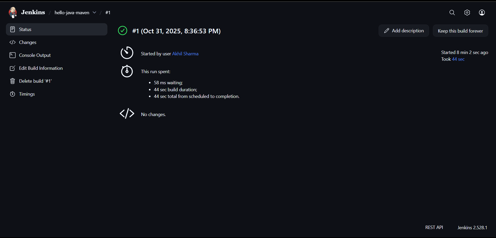

# Run a Simple Java Maven Build Job in Jenkins

## Objective
Build a simple Java Hello World application using Maven in Jenkins.

## Screenshots

**Jenkins Status**  
  

**Jenkins Console Output**  
  